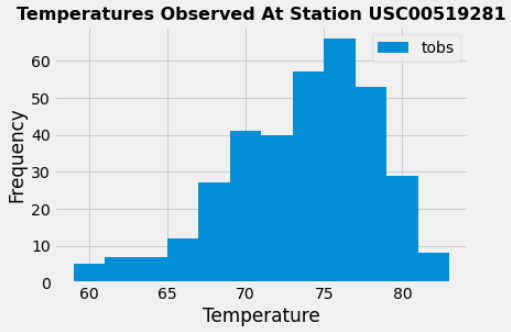

# SQLAlchemy-challenge

# Surfs Up!

### Background

Congratulations! You've decided to treat yourself to a long holiday vacation in Honolulu, Hawaii! To help with your trip planning, this repository is designed to make a climate analysis on Honolulu, Hawaii.

## Step 1 - Climate Analysis and Exploration

Using Python and SQLAlchemy, this project make a basic climate analysis and data exploration of Honolulu climate database. All of the following analysis was completed using SQLAlchemy ORM queries, Pandas, and Matplotlib. 

The complete climate analysis and data exploration can be found here:  [Jupyter Notebook](climate.ipynb) , [Data](/Resources) directory.

### Precipitation Analysis

* Data retrieved by querying the last 12 months of precipitation from the the most recent date in the data set.

* The resulted query was loaded into Pandas DataFrame in order to Plot the results using the DataFrame `plot` method.

* By using Pandas, the summary statistics for the precipitation data was generated.

Precipitation
-------------------
count	2021.000000
mean	0.177279
std	    0.461190
min 	0.000000
25%	    0.000000
50%	    0.020000
75%	    0.130000
max	    6.700000

### Station Analysis

* A query was designed to calculate the total number of stations in the dataset.

* A query was designed to find the most active stations and the lowest, highest, and average temperature were calculated.

* A query was designed to retrieve the last 12 months of temperature observation data (TOBS).

* The results were plot as a histogram.

## Step 2 - Climate App

After the initial analysis was completed, a Flask API designed based on the queries already developed.

The following routes were created by using Flask and can be found : [Flask App](app.py)

### Routes

* `/`

  * Home page.

  * List all routes that are available.

* `/api/v1.0/precipitation`

  * Convert the query results to a dictionary using `date` as the key and `prcp` as the value.

  * Return the JSON representation of your dictionary.

* `/api/v1.0/stations`

  * Return a JSON list of stations from the dataset.

* `/api/v1.0/tobs`
  * Query the dates and temperature observations of the most active station for the last year of data.

  * Return a JSON list of temperature observations (TOBS) for the previous year.

* `/api/v1.0/<start>` and `/api/v1.0/<start>/<end>`

  * Return a JSON list of the minimum temperature, the average temperature, and the max temperature for a given start or start-end range.

  * When given the start only, calculate `TMIN`, `TAVG`, and `TMAX` for all dates greater than and equal to the start date.

  * When given the start and the end date, calculate the `TMIN`, `TAVG`, and `TMAX` for dates between the start and end date inclusive.

### Copyright

Trilogy Education Services © 2020. All Rights Reserved.

